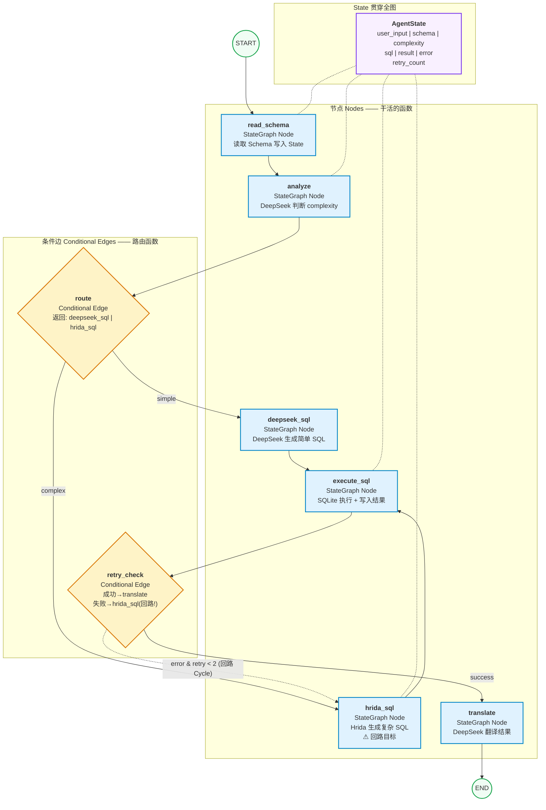

# Agent03 LangGraph 设计文档

## 术语对照

| LangGraph 术语 | 英文 | 含义 | Agent03 中的实例 |
|---------------|------|------|-----------------|
| 状态 | State | 贯穿全图的数据结构 | `AgentState`：存 user_input、schema、sql、result |
| 节点 | Node | 一个执行单元（Python 函数） | `read_schema`、`analyze`、`hrida_sql`、`execute_sql` |
| 边 | Edge | 固定连线，A→B 必定走 | `read_schema` → `analyze` |
| 条件边 | Conditional Edge | 根据 State 动态选路 | `route` 根据 complexity 选 hrida_sql 或 deepseek_sql |
| 状态图 | StateGraph | 节点+边的集合 | 整张 Agent03 图 |
| 编译 | compile() | 把图变成可执行引擎 | `app = graph.compile()` |
| 调用 | invoke() | 传入初始 State，启动执行 | `app.invoke({"user_input": "大金的子孙"})` |
| 回路 | Cycle | 边指回上游节点（关键！） | `retry` → `hrida_sql`（SQL 错误时重试） |

## Agent03 LangGraph 流程图



## 数据流：State 在各个节点的变化

| 步骤 | 节点 | State 变化 |
|------|------|-----------|
| 0 | 用户输入 | `user_input` = "大金的子孙有哪些" |
| 1 | read_schema | `schema` = "CREATE TABLE pets(...)..." |
| 2 | analyze | `complexity` = "complex", `keywords` = ["递归","子孙"] |
| 3 | hrida_sql | `sql` = "WITH RECURSIVE descendants AS ..." |
| 4 | execute_sql | `result` = "大金|小金|二狗|小小金", `error` = "" |
| 5 | retry_check | 检查 error 为空 → 走 success |
| 6 | translate | `answer` = "大金有3个子孙：小金、二狗、小小金" |

## 关键代码骨架

```python
from typing import TypedDict, Literal
from langgraph.graph import StateGraph, START, END

# ===== 1. 定义 State =====
class AgentState(TypedDict):
    user_input: str
    schema: str
    complexity: str
    keywords: list
    sql: str
    raw_result: str
    answer: str
    error: str
    retry_count: int

# ===== 2. 定义 Nodes =====
def read_schema(state: AgentState) -> AgentState:
    ...

def analyze(state: AgentState) -> AgentState:
    ...

def deepseek_sql(state: AgentState) -> AgentState:
    ...

def hrida_sql(state: AgentState) -> AgentState:
    ...

def execute_sql(state: AgentState) -> AgentState:
    ...

def translate(state: AgentState) -> AgentState:
    ...

# ===== 3. 定义条件边 =====
def route_by_complexity(state: AgentState) -> Literal["hrida_sql", "deepseek_sql"]:
    if state["complexity"] == "complex":
        return "hrida_sql"
    return "deepseek_sql"

def retry_check(state: AgentState) -> Literal["translate", "hrida_sql"]:
    if state["error"] == "":
        return "translate"
    if state["retry_count"] < 2:
        return "hrida_sql"   # ← 回路！
    return "translate"

# ===== 4. 构建图 =====
graph = StateGraph(AgentState)

# 加节点
graph.add_node("read_schema", read_schema)
graph.add_node("analyze", analyze)
graph.add_node("deepseek_sql", deepseek_sql)
graph.add_node("hrida_sql", hrida_sql)
graph.add_node("execute_sql", execute_sql)
graph.add_node("translate", translate)

# 加固定边
graph.add_edge(START, "read_schema")
graph.add_edge("read_schema", "analyze")
graph.add_edge("deepseek_sql", "execute_sql")
graph.add_edge("hrida_sql", "execute_sql")

# 加条件边
graph.add_conditional_edges("analyze", route_by_complexity, {
    "hrida_sql": "hrida_sql",
    "deepseek_sql": "deepseek_sql"
})
graph.add_conditional_edges("execute_sql", retry_check, {
    "translate": "translate",
    "hrida_sql": "hrida_sql"    # ← 回路
})

graph.add_edge("translate", END)

# ===== 5. 编译 + 调用 =====
app = graph.compile()
result = app.invoke({"user_input": "大金的子孙有哪些",
                     "retry_count": 0,
                     "keywords": []})
```

## 对比：if-else vs LangGraph

| | 现在（agent.py） | LangGraph（agent_langgraph.py） |
|---|---|---|
| 路由方式 | `if complexity == "complex":` | `route_by_complexity()` 条件边 |
| 重试方式 | 手动写循环 | `execute_sql` 边指回 `hrida_sql` |
| 状态管理 | 散落局部变量 | 集中 `AgentState` |
| 流程可视化 | 靠读代码猜 | `graph.get_graph()` 自动生成图 |
| 加新模型 | 改函数体内 if-else | `graph.add_node()` + `add_edge()` |
| 防止死循环 | 自己控制 `max_turns` | 框架自带 `recursion_limit` |
